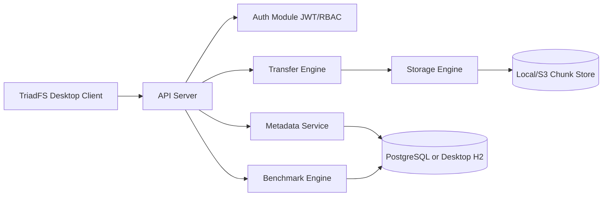
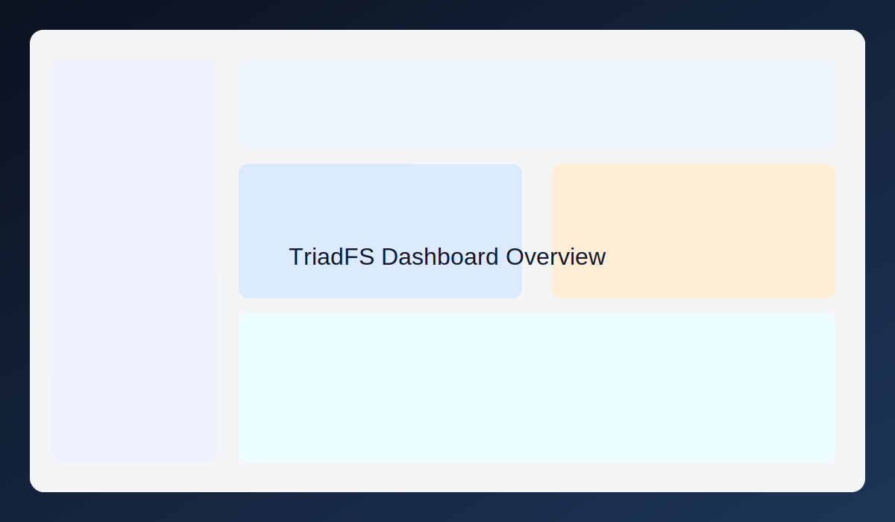

# TriadFS

TriadFS is a production-oriented, open-source research platform for exploring the speed-memory-cost tradeoff in file transfer systems.

## Vision

Traditional file tools optimize one metric at a time. TriadFS is built to evaluate three dimensions together:

1. Transfer Speed
2. Memory Usage During Transfer
3. Operational/Storage/Network Cost

The platform provides pluggable transfer strategies, chunk-based deduplicated storage, benchmark execution, and dashboard-driven comparison.

## Repository Structure

```text
TriadFS/
  backend/   # Java 21 + Spring Boot 3 + PostgreSQL + Flyway
  frontend/  # React + TypeScript + Tailwind + Radix/shadcn-style UI
  docs/      # Architecture, schema, API, benchmarks
```

## Architecture Diagram



## Key Backend Modules

- `api-server`: REST APIs, OpenAPI, global error handling, orchestration.
- `auth-module`: JWT issuance/validation and RBAC-compatible security chain.
- `metadata-service`: file tree, file versions, upload sessions, permissions, audit logs.
- `storage-engine`: chunk splitting, SHA-256 hashing, dedup indexing, reconstruction, LRU cache.
- `transfer-engine`: strategy pattern implementations and runtime strategy selection.
- `benchmark-engine`: benchmark run execution, metrics capture, ranking and leaderboard.
- `common`: shared DTOs, contracts, utilities.

## Implemented Transfer Strategies

- `WHOLE_FILE`
- `STREAMING`
- `SEQUENTIAL_CHUNK`
- `PARALLEL_CHUNK`
- `COMPRESSED`
- `ENCRYPTED`

## Core Features

- Hierarchical file/folder metadata tree
- Soft delete + restore
- Versioned files mapped to chunks
- Chunk hash deduplication
- Resumable upload sessions (chunk-index based)
- Strategy execution and benchmark comparison
- JWT auth + role-based authorization baseline
- Audit and benchmark persistence models

## Technology Stack

### Backend
- Java 21
- Spring Boot 3 (Web, Security, Data JPA, Actuator)
- PostgreSQL 16
- H2 desktop profile for standalone packaged releases
- Flyway migrations
- springdoc OpenAPI/Swagger UI
- JUnit 5, Mockito, Testcontainers baseline

### Frontend
- React 18 + TypeScript + Vite + Electron
- Tailwind CSS
- Radix primitives + shadcn-style component structure
- Recharts for analytics visualizations
- React Query + Axios

## Setup

### Prerequisites

- Java 21+
- Maven 3.9+
- Node.js 20+
- Docker (optional, for Postgres and Testcontainers)

### 1. Development / Server Mode

```bash
cd backend/infra/docker
cp .env.example .env
docker compose up -d --build
```

Optional pgAdmin:

```bash
docker compose --profile tools up -d
```

Swagger UI: `http://localhost:8080/swagger-ui/index.html`

Default seeded admin:
- email: `admin@triadfs.local`
- password: `admin123`

### 2. Desktop Development Mode

This mode uses your normal development backend or Docker stack.

```bash
cd frontend
npm install
npm run desktop:dev
```

### 3. Standalone Shareable Desktop Build

This is the production-style desktop distribution path.

- The packaged app bundles:
  - Electron desktop client
  - Spring Boot backend fat jar
  - platform-native Java runtime from the build machine
  - local embedded H2 database profile for standalone use
- The packaged app does not require Docker on the target machine.
- Build each platform on its native OS:
  - Windows builds on Windows
  - macOS builds on macOS
  - Linux builds on Linux

#### Windows

```bash
cd frontend
npm run desktop:build
```

Artifacts:
- `frontend/release/TriadFS Setup 0.1.0.exe`
- `frontend/release/TriadFS 0.1.0.exe`

#### macOS

```bash
cd frontend
npm install
npm run desktop:build:mac
```

#### Linux

```bash
cd frontend
npm install
npm run desktop:build:linux
```

### 4. Stop Backend Stack

```bash
cd backend/infra/docker
docker compose down
```

## Benchmark Output (Example)

| Strategy | Time (ms) | Throughput (Mbps) | Peak Memory (MB) | Cost (USD) |
|---|---:|---:|---:|---:|
| PARALLEL_CHUNK | 2150 | 950 | 384 | 0.2100 |
| COMPRESSED | 2840 | 710 | 310 | 0.1600 |
| STREAMING | 3290 | 592 | 170 | 0.2400 |

## Dashboard Screenshots

- 
- 

## Documentation

- [Architecture](docs/ARCHITECTURE.md)
- [Desktop Distribution](docs/DESKTOP_DISTRIBUTION.md)
- [DB Schema](docs/db/SCHEMA.md)
- [API Structure](docs/api/OPENAPI.md)
- [Benchmark Methodology](docs/BENCHMARKS.md)
- [Explorer Feature Research](docs/EXPLORER_FEATURES.md)
- [Contributing](CONTRIBUTING.md)
- [Roadmap](ROADMAP.md)

## License

Licensed under Apache-2.0. See [LICENSE](LICENSE).
